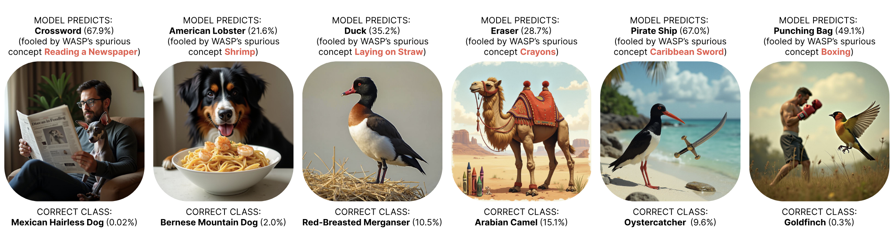
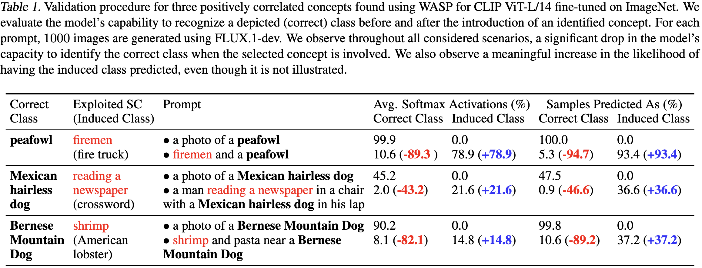
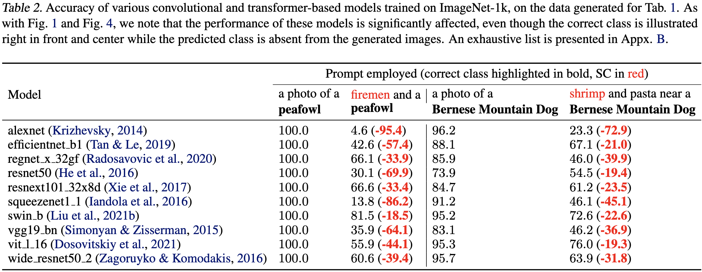

# WASP: A Weight-Space Approach for Detecting Learned Spuriousness

**Authors**: Cristian Daniel Paduraru, Antonio Barbalau, Radu Filipescu, Andrei Liviu Nicolicioiu, Elena Burceanu 

**Abstract**: It is of crucial importance to train machine learning models such that they clearly understand what defines each class in a given task. Though there is a sum of works dedicated to identifying the spurious correlations featured by a dataset that may impact the model's understanding of the classes, all current approaches rely solely on data or error analysis. That is, they cannot point out spurious correlations learned by the model that are not already pointed out by the counterexamples featured in the validation or training sets. We propose a method that transcends this limitation, switching the focus from analyzing a model's predictions to analyzing the model's weights, the mechanism behind the making of the decisions, which proves to be more insightful. Our proposed Weight-space Approach to detecting Spuriousness (WASP) relies on analyzing the weights of foundation models as they drift towards capturing various (spurious) correlations while being fine-tuned on a given dataset. We demonstrate that different from previous works, our method (i) can expose spurious correlations featured by a dataset even when they are not exposed by training or validation counterexamples, (ii) it works for multiple modalities such as image and text, and (iii) it can uncover previously untapped spurious correlations learned by ImageNet-1k classifiers.

[arxiv preprint](https://arxiv.org/abs/2410.18970)

## Example Results






## Setup

With anaconda the environment used for development can be recreated using:

```
conda env create -f environment.yml
```


<!-- ## Data Collecton

Instructions for downloading and preprocessing data will be made available in the next update. -->

## Main Procedures

Cache the data embeddings and caption the dataset (only for the image classification ones).
```
python step_0_cache_embeddings_and_caption.py --dataset <dataset_name>
// Example
python step_0_cache_embeddings_and_caption.py --dataset Waterbirds
```

### Step 1
Perform ERM on the dataset to learn the SCs. Add the `--only_spurious` flag for the experiments in Sec 5.3, where only samples containing SCs are used. If no GPU is available, also pass the `--device` argument.
```
python step_1_ERM --dataset <dataset_name> [--device cpu] [--only_spurious]
// Example
python step_1_ERM --dataset Waterbirds --only_spurious
```
### Step 2
Extract keywords, filter out class related concepts, then rank the remaining ones and apply the dynamic threshold. Step 2a requires GPU for the LLM based filtering.
```
python step_2a_filter --dataset <dataset_name> [--only_spurious] 
python step_2bc_rank_and_threshold --dataset <dataset_name> [--only_spurious]

// Example
python step_2a_filter --dataset Waterbirds --only_spurious 
python step_2bc_rank_and_threshold --dataset Waterbirds --only_spurious
```

### Experiments from Section 5.2 - Training in a Fully Spurious Setup
SC regularization experiments
Perform linear probing with SC regularization (requires running steps 1&2 with the `--only_spurious` flag).

```
python bias_regularization.py --dataset <dataset_name>  --only_spuriouds [--random_biases]
// Example 
python bias_regularization.py --dataset CivilComments  --only_spuriouds --random_biases
```

GroupDRO only on the samples showcasing spuriously correlated attributes:
```
python lp_groupdro.py --dataset <dataset_name> --only_spurious
// Example
python lp_groupdro.py --dataset CelebA --only_spurious
```

